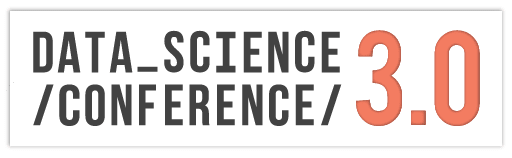

# Datascience 3.0 - Machine learning preconference course

## About the course
Course is planned to be held on 20th of November at [Startit](https://startit.rs/) center as part
of the Datascience 3.0 conference devoted to the field of Data science. Course goal is to introduce
the field of Machine learning to participants through a practical approach, but also point
participants in the right direction when it comes to the theoretical approach.

## About the instructor
[Nemanja Mićović](http://poincare.matf.bg.ac.rs/~nemanja_micovic/)
is a teaching asistant at [Faculty of Mathematics](http://www.matf.bg.ac.rs/eng/)
intested in Machine learning research and appliance. He is currently responsible
for [Machine Learning and Applications Group](http://machinelearning.math.rs) practical sessions
aimed towards experimenting, applying and developing machine learning algorithms, and also
the founder and main organizer of [RISK - student organization for programming](http://risk.matf.bg.ac.rs/).

## Abstract

#### Introduction to Machine Learning algorithms using scikit-learn

Machine learning (ML) is a field of Artificial Intelligence which has produced incredible
breakthroughs in the last decades and is extensively used in industry today. Some of the
breakthroughs are system Watson winning in quiz Jeopardy! in 2011, autonomous car driving,
image classification (accuracy of which exceeds the one one of the average human), and Google‘s
AlphaGo beating world champion in Go in 2016.

Course aims to introduce pariticipants to the basics of machine learning, to give explanations of
supervised, unsupervised and reinforcement learning, and also to give an understanding of some
of the most widely applied algorithms from the field in problems of regression and classification.
Course will cover algorithms like K-Nearest Neighbours, Decision Trees, Logistic and Linear
Regression, Neural Networks, and K-Means. Course will also show how to evaluate models
produced by algorithms and how to recognize and handle underfitting and overfitting.
Algorithms will be applied using Python and scikit-learn library on real life data, but they will
also be discussed from a theoretical perspective.

## Knowledge requirements
- Basic programming knowledge
- Basic python knowledge

If you want to bring yourself up to speed with Python,
check the following free [video tutorial](https://www.youtube.com/watch?v=HBxCHonP6Ro&list=PL6gx4Cwl9DGAcbMi1sH6oAMk4JHw91mC_).

## What we will use
- Python3
- Python IDE: [Pycharm](https://www.jetbrains.com/pycharm/)
- Python library: [numpy](http://www.numpy.org/)
- Python library: [pandas](http://pandas.pydata.org/)
- Python library: [matplotlib](https://matplotlib.org/)
- Python library: [scikit-learn](http://scikit-learn.org/)

## How to install libraries

#### Windows
It is recommended to use [Anaconda](https://www.anaconda.com/download/#linux) (for Python3) to avoid manual install of required libraries.

#### GNU/Linux
You can also use Anaconda, though you should generally referer to your distribution's recommended way of installing libraries.
